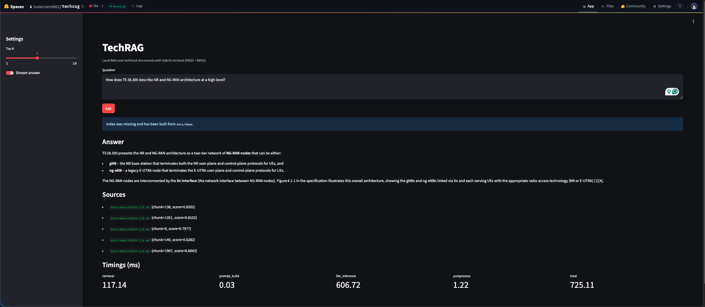
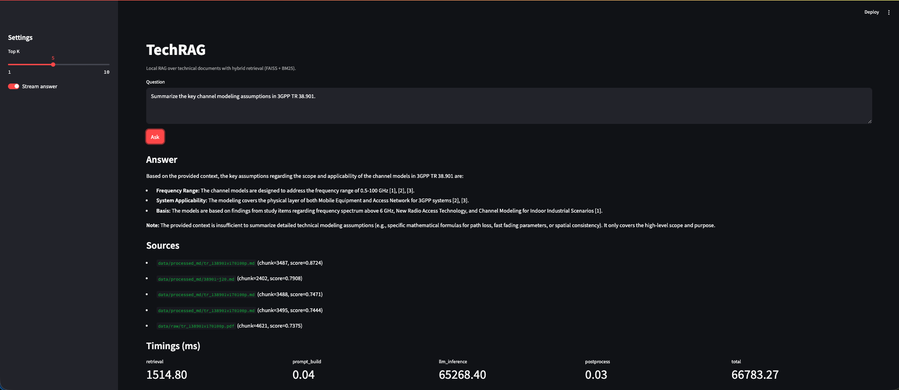

# TechRAG

<p align="center">

  
  
  
  
  
  
</p>

A production-oriented retrieval-augmented generation (RAG) system for technical documentation.

TechRAG uses a practical local-first workflow: ingest documents, build a FAISS index, run hybrid retrieval (semantic + BM25), and generate grounded answers with citations.

## Live Demo

- Hugging Face Space: https://huggingface.co/spaces/turancannb02/techrag
- On Spaces, if `storage/` index files are missing, the app auto-builds a fresh index on startup from `data/` (or falls back to `demo_data/`).

## Demo

> **Note:** On first load, HF Space auto-builds the index from `data/demo/` — this is expected, not an error.



## Branches

- `main`: primary development branch (local-first workflow and project source of truth)
- `hf-space`: deployment-focused branch for Hugging Face Spaces runtime/integration

## What This Is

TechRAG is built to explore and operate a full RAG workflow over technical corpora (standards, engineering docs, and research text) without hiding core decisions behind abstraction-heavy wrappers.

The current repository contains a working MVP with:

- End-to-end ingestion and indexing
- Hybrid retrieval (semantic + BM25)
- CLI querying with timing instrumentation
- FastAPI serving (normal + streaming)
- Streamlit UI for interactive testing
- Mixed corpus workflow (`data/raw` + `data/processed_md`) with optional MarkItDown conversion

## Features

- **Multi-format ingestion** (`.pdf`, `.md`, `.txt`, `.html`)
- **Hybrid corpus handling** (use raw PDFs directly, plus optional converted Markdown)
- **Configurable chunking** with `RecursiveCharacterTextSplitter`
- **Embedding + vector index pipeline** (HuggingFace or Ollama embeddings + FAISS)
- **Hybrid retrieval** using FAISS similarity + BM25 fusion
- **Citation-aware answer generation** from retrieved context
- **Streaming generation** in CLI and API (NDJSON events)
- **Timing breakdowns** for retrieval vs inference bottlenecks
- **Streamlit interface** for fast local iteration
- **Optional MarkItDown integration** for converting selected documents (for example `.docx -> .md`)

## LLM / Embedding Backends

TechRAG supports backend switching via `config.yaml`:

- LLM backends: `groq` or `ollama`
- Embedding backends: `huggingface` or `ollama`

HF Spaces-friendly default:

- `llm_backend: groq` with `GROQ_API_KEY` in environment secrets (`openai/gpt-oss-20b`)
- `embedding_backend: huggingface` with a sentence-transformers model

If you change embedding model or embedding backend, rebuild the index (`ingest.py`) before querying.

## Running Locally

```bash
uv sync
```

### 1. Configure backend and secrets

Current default in `config.yaml` is:

- LLM: Groq (`openai/gpt-oss-20b`)
- Embeddings: HuggingFace (`sentence-transformers/all-MiniLM-L6-v2`)

Set your API key:

```bash
export GROQ_API_KEY=your_key_here
```

For local development you can also keep it in `.env`:

```dotenv
GROQ_API_KEY=your_key_here
```

See `.env.example` for the minimal secret template.

Optional local Ollama mode:

```yaml
models:
  llm_backend: ollama
  embedding_backend: ollama
  llm: glm-5:cloud
  embedding: nomic-embed-text-v2-moe
  base_url: http://localhost:11434
```

### 2. Build / rebuild index

```bash
uv run python ingest.py --source data
```

This includes files from both `data/raw` and `data/processed_md` in one index build.
PDF files are ingested directly; conversion is optional.

### Optional: Use MarkItDown for selected conversions

If you want to normalize some files (for example `.docx`) into Markdown:

```bash
uv tool install "markitdown[docx]"
markitdown data/raw/38300-j10.docx -o data/processed_md/38300-j10.md
markitdown data/raw/38901-j20.docx -o data/processed_md/38901-j20.md
```

Then re-run ingestion:

```bash
uv run python ingest.py --source data
```

### 3. Query from CLI

```bash
uv run python chain.py --query "Summarize the key channel modeling assumptions in 3GPP TR 38.901."
```

With timings:

```bash
uv run python chain.py --query "How does TS 38.300 describe NR and NG-RAN architecture at a high level?" --show-timings
```

With token streaming:

```bash
uv run python chain.py --query "What does the LangChain retrieval documentation say about retrieval-augmented generation?" --stream --show-timings
```

### Sample CLI Output

```bash
uv run python chain.py --query "How does TS 38.300 describe NR and NG-RAN architecture at a high level?" --show-timings
```

```text
Answer:

Based on the provided context, TS 38.300 describes the overall architecture by defining an NG-RAN node as either [1]:

*   A **gNB**, providing NR user plane and control plane protocol terminations towards the UE.
*   An **ng-eNB**, providing E-UTRA user plane and control plane protocol terminations towards the UE.

Additionally, the **Xn** interface is defined as the network interface between NG-RAN nodes [1].

Sources:
- data/processed_md/38300-j10.md (chunk=138, score=0.8852)
- data/processed_md/38300-j10.md (chunk=1351, score=0.8637)
- data/processed_md/38300-j10.md (chunk=0, score=0.8595)
- data/processed_md/38300-j10.md (chunk=227, score=0.718)
- data/processed_md/38300-j10.md (chunk=1352, score=0.7083)

Timings (ms):
- retrieval: 241.84
- prompt_build: 0.04
- llm_inference: 53211.59
- postprocess: 0.03
- total: 53453.5
```



### 4. Run API server

```bash
uv run uvicorn serve:app --reload
```

| Endpoint | Method | Description |
|---|---|---|
| `/` | GET | API info |
| `/health` | GET | Health status |
| `/query` | POST | Query (normal or streaming) |

Standard query:

```bash
curl -X POST http://127.0.0.1:8000/query \
  -H "Content-Type: application/json" \
  -d '{"query":"Summarize the key channel modeling assumptions in 3GPP TR 38.901.","top_k":5}'
```

Streaming query (NDJSON):

```bash
curl -N -X POST http://127.0.0.1:8000/query \
  -H "Content-Type: application/json" \
  -d '{"query":"How does TS 38.300 describe NR and NG-RAN architecture at a high level?","top_k":5,"stream":true}'
```

NDJSON events:

- `meta`
- `token`
- `done`
- `error`

Readable stream client:

```bash
uv run python scripts/stream_client.py \
  --query "What does the LangChain retrieval documentation say about retrieval-augmented generation?" \
  --top-k 5
```

### 5. Run Streamlit UI

```bash
uv run streamlit run app.py
```

## Configuration

Key settings in `config.yaml`:

```yaml
chunking:
  chunk_size: 512
  overlap: 64

retrieval:
  top_k: 5
  hybrid_weight: 0.6

models:
  llm_backend: groq
  embedding_backend: huggingface
  llm: openai/gpt-oss-20b
  embedding: sentence-transformers/all-MiniLM-L6-v2
  base_url: http://localhost:11434

storage:
  index_dir: storage/faiss
  chunks_file: storage/chunks.jsonl
```

`retrieval.hybrid_weight` interpretation:

- `0.0` = pure semantic
- `1.0` = pure BM25

## Performance Notes

Use `--show-timings` to inspect latency contributors:

- `retrieval_ms`
- `prompt_build_ms`
- `llm_inference_ms`
- `postprocess_ms`
- `total_ms`

- In most runs, `llm_inference_ms` dominates total time.
- On Groq free tier, expect roughly **50–65 seconds cold start** for the first query after startup.
- Local Ollama inference is typically slower in absolute speed, but more consistent across repeated runs once models are loaded.
- First-query latency spikes are expected and do not necessarily indicate a broken pipeline.

## What I Learned

- Retrieval quality is more sensitive to chunking strategy and corpus hygiene than expected.
- Hybrid retrieval (semantic + BM25) is consistently more robust than dense retrieval alone on standards-style documents.
- Citation grounding materially improves trustworthiness when answering dense technical questions.
- Small operational details (index freshness, model/backend alignment, runtime env) matter as much as model choice for a stable demo.

<details>
<summary><strong>Troubleshooting</strong></summary>

- Error: `No supported documents found in data`
  - Add `.md`, `.txt`, `.pdf`, or `.html` files to `data/`, then rerun ingestion.
- Error: model not found
  - In Ollama mode: ensure the model exists in `ollama list`.
- Error: missing `GROQ_API_KEY`
  - Set `GROQ_API_KEY` in env (or HF Space secrets / local `.env`) when `llm_backend: groq`.
- Retrieval quality drops after changing embedding model
  - Rebuild index with `uv run python ingest.py --source data`.

</details>

## Project Structure

```text
techrag/
├── ingest.py
├── retriever.py
├── chain.py
├── serve.py
├── app.py
├── evaluate.py
├── scripts/stream_client.py
├── config.yaml
├── pyproject.toml
├── requirements.txt
├── uv.lock
├── data/
│   ├── raw/           # original source files (pdf/docx/md/etc.)
│   └── processed_md/  # optional normalized markdown via MarkItDown
└── storage/
```

## Roadmap

- [ ] Add structured evaluation with RAGAS
- [ ] Add reranking stage
- [ ] Add metadata filtering and query-time retrieval controls
- [ ] Add Dockerized deployment targets

## References

- MarkItDown: https://github.com/microsoft/markitdown
